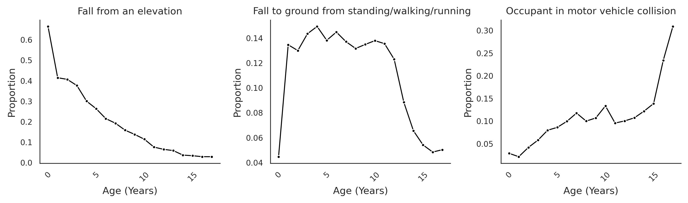
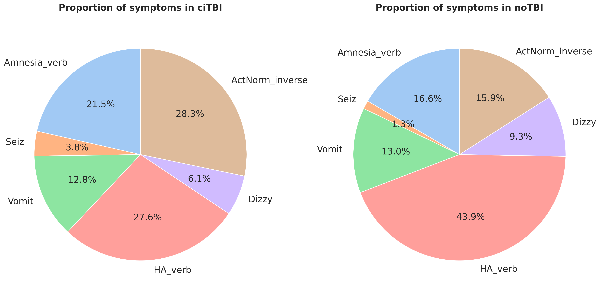
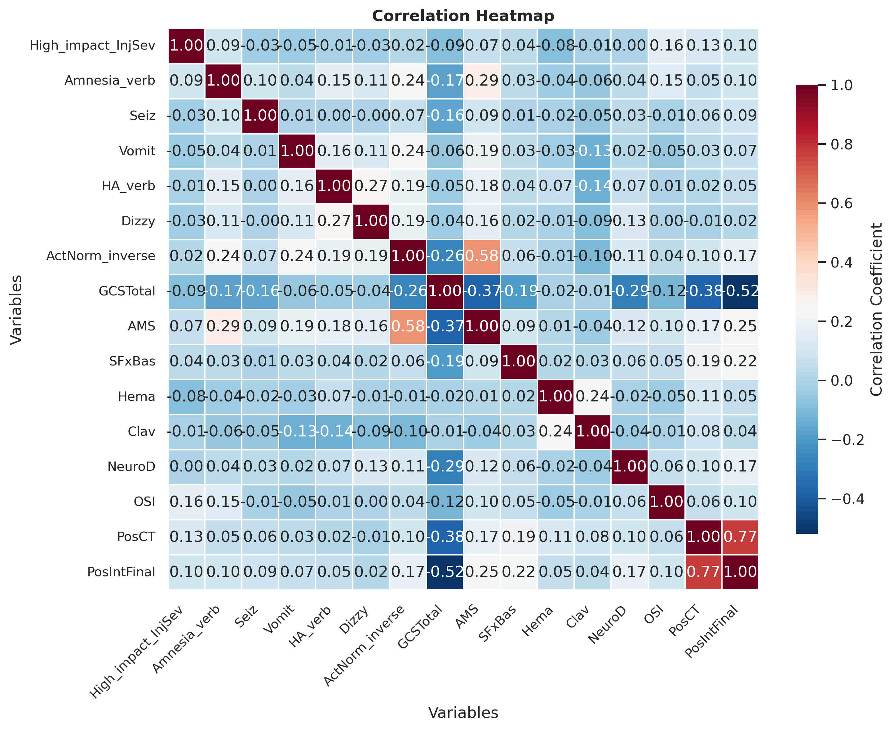
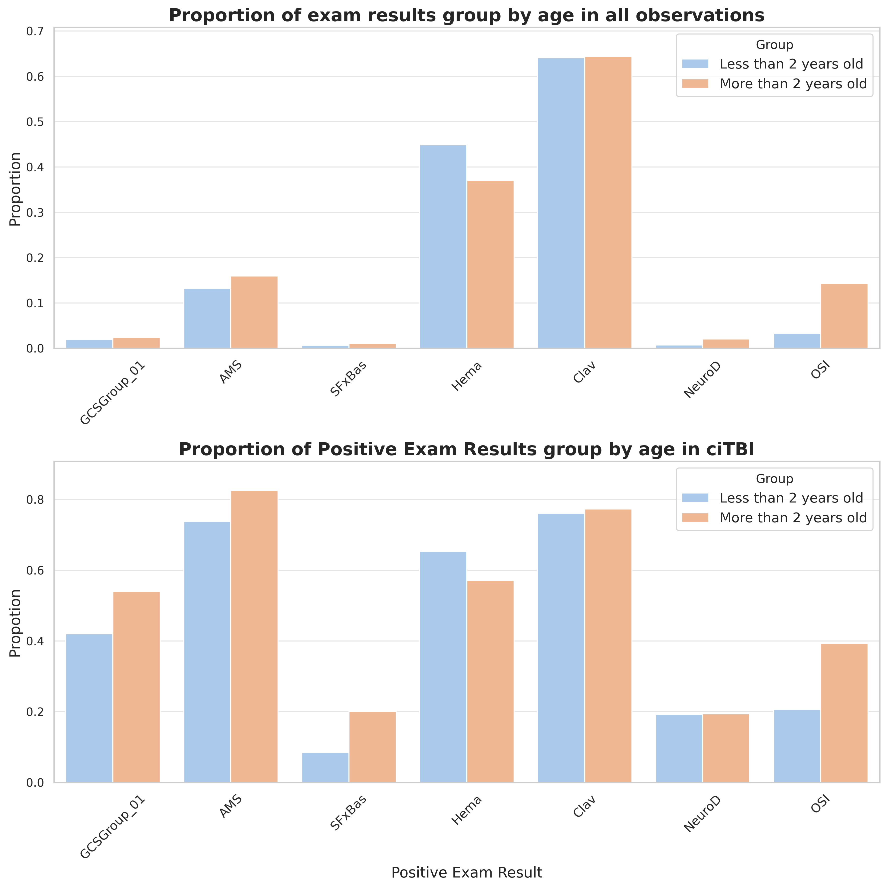
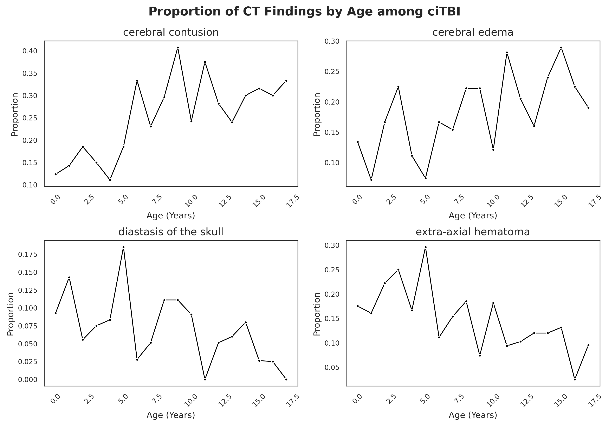

# TBI Risk Prediction: Exploratory Data Analysis & Modeling

This project performs an Exploratory Data Analysis on the PECARN TBI dataset to predict the risk of clinically important traumatic brain injury (ciTBI) in children following blunt trauma. The ultimate goal is to assist in clinical decision-making to reduce unnecessary CT scans and radiation exposure in pediatric patients.

The following paragraphs give a brief run-through of the contents of this project. A more detailed version of the steps is written in [Report.pdf](https://github.com/jjwang02/TBI-Risk-Prediction/blob/main/report/report.pdf).

## Data

The data we used for analysis originates from a prospective observational study conducted by the Pediatric Emergency Care Applied Research Network([PECARN](https://pecarn.org/pecarn_studies_pubs/childhood-head-trauma-a-neuroimaging-decision-rule/)) across 25 emergency departments. It consists of 42,412 row, each representing an emergency department visit by a child under 18 within 24 hours of blunt head trauma, and 114 columns(variables). More specifically, the variables include mechanism of injury, clinical variables (history, symptoms, and physical examination findings), and basic demographic information such as age and race. The primary outcomes include whether the patient experienced a clinically important traumatic brain injury (ciTBI) and the presence of traumatic brain injury as confirmed by CT scan.

## Code

 - [cleaning.py](https://github.com/jjwang02/TBI-Risk-Prediction/blob/main/code/cleaning.py): data cleaning file used to handle special code replacement, GCS score corrections, and NA value assessment.
 - [eda.ipynb](https://github.com/jjwang02/TBI-Risk-Prediction/blob/main/code/eda.ipynb): EDA performed for determining data cleaning strategy, and exploring injury patterns and symptoms.
 - [main.py](https://github.com/jjwang02/TBI-Risk-Prediction/blob/main/code/main.py): main file used to generate plots and report from raw data.
 - [helper.py](https://github.com/jjwang02/TBI-Risk-Prediction/blob/main/code/helper.py): helper functions used in main.py to generate results and plots in the report.

## Analysis
 

### 1. Exploratory Data Analysis (EDA)

#### Mechanism of Injury
* Age Trends: The mechanism of injury shifts significantly as children age. Falls from elevations decrease sharply with age, while injuries from motor vehicle collisions generally increase as children grow more mobile.

#### Symptom Profiles & Correlations
* Symptom Distribution: In the ciTBI group, abnormal behavior (`ActNorm_inverse`) and headaches (`HA_verb`) are the most frequent symptoms.
* Indicator Strengths: Correlation analysis shows that `GCS Total` is a strong indicator for positive findings, while individual symptoms alone are often weak predictors of TBI on CT.

#### Age-Stratified Clinical Signals
As children age, Altered Mental Status (AMS) and GCS scores become increasingly important indicators of ciTBI. In contrast, younger children (under 2 years) are more prone to exhibiting hematomas across all observations.

#### Age-Related CT Variations
Specific CT findings vary by physiology: For example, diastasis of the skull (separation of cranial sutures) is most prevalent in children aged 0-5 due to incomplete skull.

### 2. Modeling

We implemented Logistic Regression and Random Forest models to predict the need for CT scans. To address the scarcity of ciTBI cases, we used "balanced" class weights.
The prediction threshold was lowered from 0.5 to 0.3 to minimize false negatives (missed diagnoses), prioritizing patient safety.

The models demonstrated robust performance with an AUC of 0.74. Stability checks confirmed the system is not overly sensitive to data perturbations.

## Reference
Kuppermann N, et al. (PECARN). Identification of children at very low risk of clinically-important brain injuries after head trauma: a prospective cohort study. [doi:10.1016/S0140-6736(09)61558-0](https://doi.org/10.1016/S0140-6736(09)61558-0)